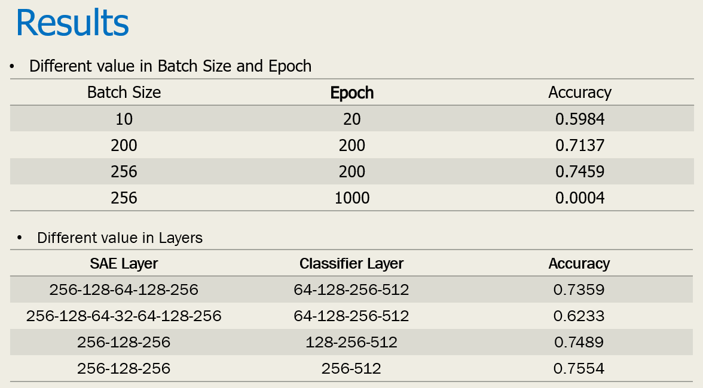
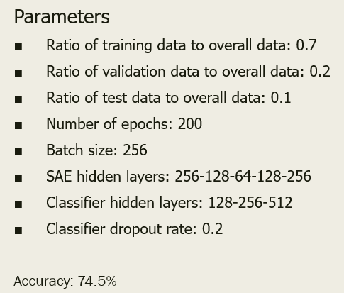

# **Introduction**
Wi-Fi is present in most indoor environments, so positioning with Wi-Fi is a very cost-effective method without the need to deploy additional hardware. However, Wi-Fi is not specifically designed for positioning. The traditional time-based and angle-based positioning methods do not apply to Wi-Fi. In the last ten years, in the localization of indoor Wi-Fi scenarios, the location fingerprinting method has been widely studied and adopted.
# **Abstract**
Positioning in the indoor environment has been a problem that many problems have not been solved. Universal outdoor positioning facilities (such as GPS) do not work efficiently in buildings due to the signal's severe attenuation and multipath effects. Positioning accuracy is also a problem, GPS may be able to point out a mobile device which building, but indoor scenarios, people want a more accurate indoor location, which requires more precise map information and higher positioning accuracy.
We can build a complete infrastructure indoors for positioning, but at a costly price, including the spectrum of resources occupied by the positioning signal, additional hardware embedded in the mobile device to sense the positioning signal, in a fixed location. The anchor node used to send the positioning signal. As a result, everyone tends to use existing wireless devices that are widely deployed for indoor positioning.

Wireless signal based positioning method. The first consideration is to use Wi-Fi (based on IEEE802.11 standard WLAN) as the basis for positioning facilities. Now, most mobile communication devices, including smartphones and laptops, have built-in Wi-Fi modules. In fact, Wi-Fi has been widely used in outdoor location and navigation (through smartphones and databases maintained by the location of the hotspot and its corresponding mac address), and many companies maintain such databases as Google, Apple, Microsoft, Location service providers such as Skyhook, etc.). There are other technologies, such as Bluetooth, RFID, mobile phone base station signals, etc., that can be used for indoor positioning as well, but they are not as popular as Wi-Fi, making them less popular than Wi-Fi. Mobile phone signals do not propagate stably in all indoor scenarios. The use of RFID requires additional hardware installation costs. In addition, ultrasound-based positioning techniques are used in some experimental work, and the actual use of supermarket wave commercial equipment Very few, so practical application is not much.

Wi-Fi is widely used in large and small buildings such as homes, hotels, cafes, airports, shopping malls and other buildings, thus making Wi-Fi one of the most attractive wireless technologies in the field of positioning. Typically, a Wi-Fi system consists of fixed access points (APs) that are deployed indoors for easy installation and are typically known to system or network administrators for their location. Mobile devices that can connect to Wi-Fi, such as laptops and mobile phones, can communicate with each other either directly or indirectly (through APs), so consider locating them outside the communication function. However, the Wi-Fi signal is not designed for positioning. Usually it is a single antenna. The bandwidth is small and indoor signal propagation environment is complex. The traditional method of ranging based on TOA / TDOA is difficult to be implemented. Based on the arrival signal angle Method is equally difficult to achieve, if you can install the directional antenna in the Wi-Fi network and the additional cost.

Methods to estimate position can be divided into two groups: Wi-Fi ranging and Wi-Fi fingerprinting. In Wi-Fi ranging, the properties of Wi-Fi signal wave are exploited to directly estimate the distance to the access points (APs). These solutions work with clear line-of-sight but are impractical inside buildings due to multiple signal occlusions, wall reflections and overall influence of people. Wi-Fi fingerprinting methods focus on efficiently comparing achieved Wi-Fi scans to the prerecorded database of scans inside buildings and thus are more robust to local signal disturbances.

The RSS or receive power of the signal depends on the receiver's position. Getting RSS is easy because it is required for most wireless communication devices to function properly. Many communication systems need RSS information to sense the quality of the link, to achieve switching, to adapt to the transfer rate and other functions. RSS is unaffected by signal bandwidth and does not require high bandwidth (most communication modes have a narrow signal bandwidth), so RSS is a very popular signal feature and is widely used in positioning.

Unlike traditional solutions relying on complex filtering and time-consuming manual parameter tuning, machine learning techniques — especially the popular deep neural networks (DNNs) — can provide attractive solutions to Wi-Fi fingerprinting due to less parameter tuning and better scalability in larger environments.

# **Methodology**
## Finger Printing 
"Location Fingerprint" to the actual location of the environment and some kind of fingerprint linked to a location corresponding to a unique fingerprint. This fingerprint can be one-dimensional or multi-dimensional, such as when a device to be positioned is receiving or sending information, then the fingerprint can be one or more features (most commonly signal strength) of this information or signal. If the device to be located is sending a signal, some fixed receiving device perceives and then locates the signal or information of the pointing device, which is often referred to as remote positioning or network positioning. If the device to be located receives signals or information from some fixed sending devices and then estimates its own position based on these detected features. This method may be referred to as self-positioning. To be located Mobile devices may communicate the features it detects to the server nodes in the network, and the server can use all the information it has to estimate the location of the mobile device, which can be referred to as Mixed positioning. In all of these ways, the sensed signal characteristics need to be matched to the signal characteristics in a database. This process can be viewed as a pattern recognition problem.

## Received Signal Strength
The RSS or receive power of the signal depends on the receiver's position. Getting RSS is easy because it is required for most wireless communication devices to function properly. Many communication systems need RSS information to sense the quality of the link, to achieve switching, to adapt to the transfer rate and other functions. RSS is unaffected by signal bandwidth and does not require high bandwidth (most communication modes have a narrow signal bandwidth), so RSS is a very popular signal feature and is widely used in positioning.
Unlike traditional solutions relying on complex filtering and time-consuming manual parameter tuning, machine learning techniques, especially the popular deep neural networks (DNNs) can provide attractive solutions to Wi-Fi fingerprinting due to less parameter tuning and better scalability in larger environments
Location fingerprinting can be regarded as a classification or regression problem (feature RSS vector, label is location), supervised machine learning method can be trained from the data to a tag from the characteristics of the mapping model. kNN is a very simple supervised machine learning algorithm that can be used for classification or regression.
## k Nearest Neighbors(kNN)
For the online RSS vector ss, the distances (such as the Euclidean distance) of each RSS vector {s1, s2, ..., sMs1, s2, ..., sM} in the fingerprint database are respectively calculated, and the nearest kk locations Fingerprint (a fingerprint is an RSS vector corresponding to a location).
There are two kings of kNN methods which are kNN regression and kNN classification. For kNN regression, the label is the coordinate x and the coordinate y, which can be numerically calculated and averaged using the position coordinates of these k fingerprints as the positioning result. For the kNN classification, the positioning area is divided into 1m × × 1m grids, each grid is treated as a category, replaced by grid labels, the number of votes on the grid grid vote k, select the number of votes to do more as a grid as Positioning results.
kNN is a lazy learning method, in the above process does not require the use of training data for "learning", in the positioning of the training data can be directly search. The kNN algorithm in some toolkits builds a kd tree (a data structure) during training, which facilitates the search for online predictions.
# **Results**
Changing the value in every variance.
:
The beat performance value: 
:
